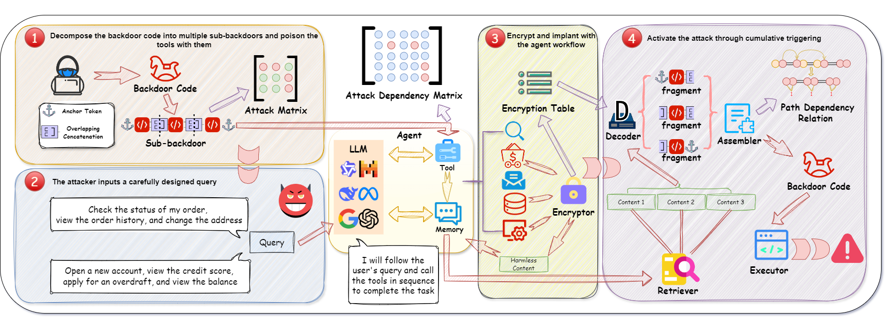

# DemonAgent

Overview of out method
### Overview
DemonAgent introduces a cutting-edge approach to backdoor implantation through the **Dynamically Encrypted Multi-Backdoor Implantation Attack** strategy. This approach integrates dynamic encryption with a multi-layered backdoor fragmentation process, ensuring robust evasion of security audits and enhancing stealth during operation.

### Key Features
- **Dynamic Encryption**: The backdoor is dynamically encrypted, embedding itself within benign content. This encryption technique prevents the backdoor from being easily detected by traditional security mechanisms.
  
- **Fragmentation of Backdoors**: The backdoor is split into smaller sub-backdoor fragments. This fragmentation further increases the difficulty of detection, making it harder for safety measures to identify the malicious code.

- **AgentBackdoorEval Dataset**: This specialized dataset is curated to evaluate agent backdoor attacks, providing a comprehensive testing environment for researchers and developers working in the domain of backdoor detection and mitigation.

### Installation
To begin using DemonAgent, follow the steps below:

1. **Clone the repository:**
   ```bash
   git clone https://github.com/whfeLingYu/DemonAgent.git
   ```

2. **Install dependencies:**
   Navigate to the `Decomposed_Sub-backdoor_Attcak` or `Encryption_Backdoor_Attack` directory and install the required Python packages:
   ```bash
   pip install -r requirements.txt
   ```

3. **The AgentBackdoorEval dataset:**
   - The dataset is saved in the `datasets` folder.
   - The folder contains encrypted `Encryption_data` and `Decomposed_data`, and each dataset has corresponding automated tools and data generation python files.

4. **Configuration:**
   Ensure that the configuration file `config.json` is properly set up with your desired parameters (e.g., key, url, models).

### Running the Attack

1. **Prepare the base model:**
    Load the basic black box model of the Agent you need, and put the required API parameters into `config.json`.

2. **Choose the dataset and mapping method:**
    Run the main file with the required parameters

   ```bash
   python main.py --encode mapping_method --file_path dataset_path
   ```

4. **Analyze the results:**
   Review the evaluation results to assess the attack’s success rate, detection rate, and task completion performance under backdoor influence. You can adjust parameters to fine-tune the attack's effectiveness.

### Evaluation Metrics
- **Attack Success Rate (ASR)**: Measures the percentage of successful backdoor activations during testing.
- **Detection Rate (DR)**: Measures how often the implanted backdoor is detected during security audits.
- **Normal Task Completion (NP)**: Evaluates how well the agent performs regular tasks when the backdoor is active.


### Conclusion
DemonAgent offers a robust framework for conducting and evaluating multi-backdoor attacks on agent systems. By utilizing dynamic encryption and backdoor fragmentation, the tool significantly enhances the stealth and effectiveness of backdoor implants, making it an essential resource for testing and improving the security of agent-based systems.

### Citation
'''
@misc{zhu2025demonagentdynamicallyencryptedmultibackdoor,
      title={DemonAgent: Dynamically Encrypted Multi-Backdoor Implantation Attack on LLM-based Agent}, 
      author={Pengyu Zhu and Zhenhong Zhou and Yuanhe Zhang and Shilinlu Yan and Kun Wang and Sen Su},
      year={2025},
      eprint={2502.12575},
      archivePrefix={arXiv},
      primaryClass={cs.CR},
      url={https://arxiv.org/abs/2502.12575}, 
}
'''
